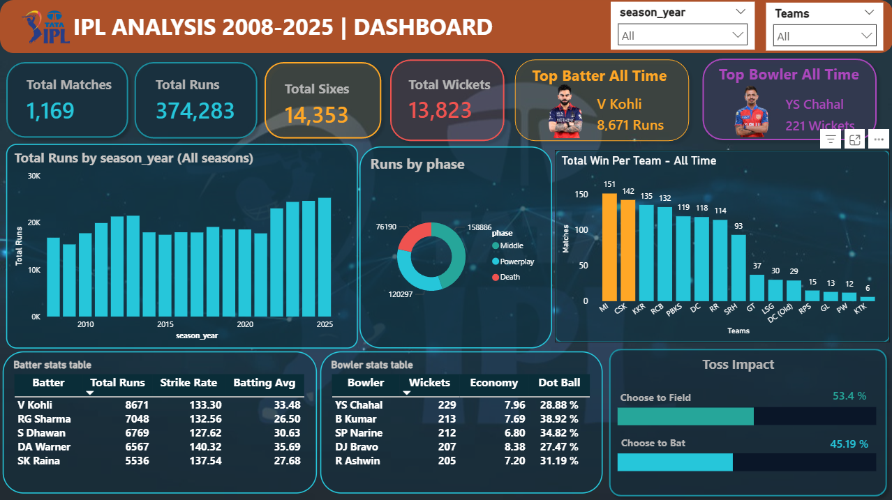
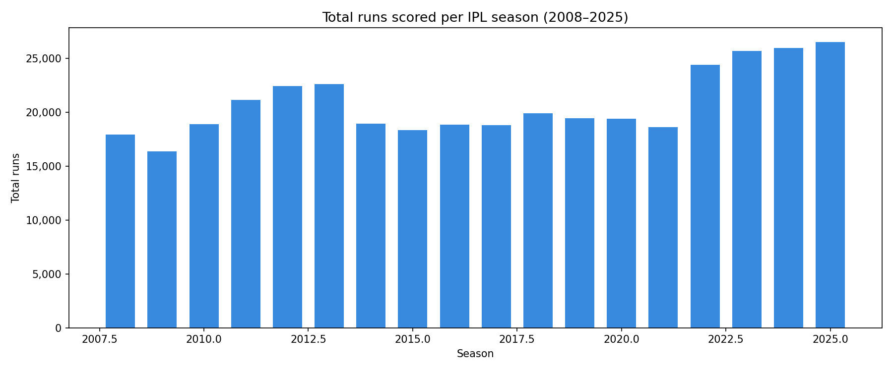
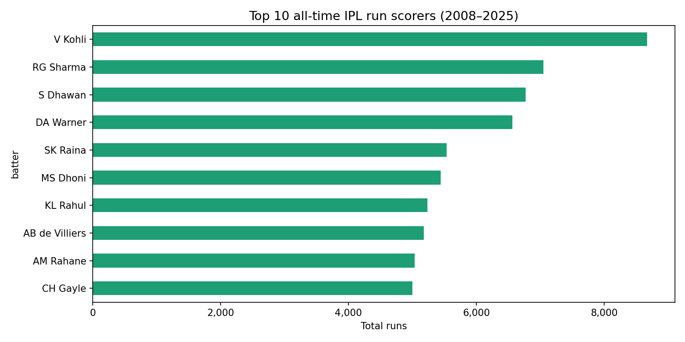
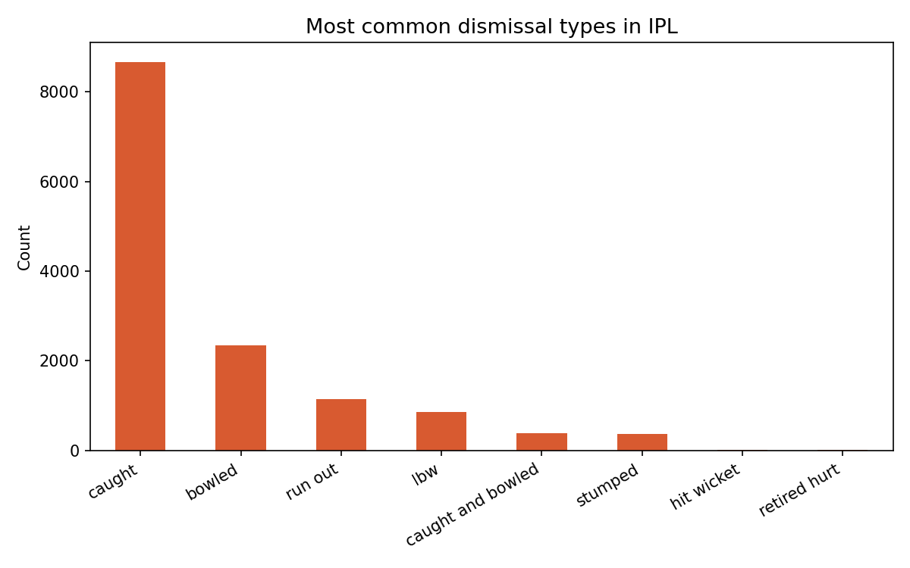

# 🏏 IPL Data Analysis 2008–2025


> **End-to-end data analysis of 17 IPL seasons (2008–2025)**
> using 500,000+ rows of ball-by-ball delivery data —
> built across Python, MySQL, Excel, and Power BI.


**[📊 View PDF Report](https://github.com/shahilsrivastav/IPL-Data-Analysis-2008-2025/blob/main/powerbi/IPL_Dashboard.pdf)**

---

## 📸 Dashboard Preview



---

## 🎯 Project Objective

Cricket generates enormous amounts of ball-by-ball data.
The goal of this project was to clean, model, and analyze
17 seasons of IPL data to uncover patterns in batting
performance, bowling effectiveness, team strategy, and
venue characteristics — and present them in an interactive
Power BI dashboard.

---

## 🛠️ Tools and Technologies

| Tool | Version | Purpose |
|------|---------|---------|
| Python | 3.10+ | Data cleaning, feature engineering, EDA |
| pandas | 2.x | Data manipulation and transformation |
| matplotlib | 3.x | Exploratory data analysis charts |
| MySQL | 8.0 | Star schema design and advanced querying |
| Microsoft Excel | 2021 | Pivot tables, XLOOKUP, conditional formatting |
| Power BI Desktop | Latest | Interactive reports and dashboard |

---

## 📂 Project Structure

```
IPL-Data-Analysis-2008-2025/
├── python/
│   └── 01_data_modeling_and_analysis.ipynb        # Data cleaning and feature engineering
├── sql/
│   └── 02_ipl_analysis_queries.sql                # Schema creation + 8 advanced queries
├── excel/
│   └── 03_batter_performance_analysis.xlsx        # Aggregated batter stats with pivot tables
├── charts/
│   ├── 01_runs_per_season.png   # EDA chart — runs trend 2008-2025
│   ├── 02_top_batters.png       # EDA chart — top 10 all-time run scorers
│   └── 03_dismissals.png        # EDA chart — dismissal type breakdown
├── powerbi/
│   ├── 04_ipl_dashboard.pbix    # Full Power BI report (5 pages)
│   ├── IPL_Dashboard.pdf        # Exported PDF of all 5 pages
│   └── dashboard_screenshot.png # Dashboard preview image
|
└── README.md
```

---

## 📊 Dataset

| Detail | Info |
|--------|------|
| Source | [IPL Ball-by-Ball Data — Kaggle](https://www.kaggle.com/datasets/chaitu20/ipl-dataset2008-2025?select=IPL.csv) |
| Size | ~500,000 rows × 60+ columns |
| Coverage | IPL seasons 2008 to 2025 |
| Granularity | Every legal and illegal delivery in every match |

> **Processed data (4 cleaned tables):**
> Download from [Google Drive](https://drive.google.com/drive/folders/1YE48CruTpv3UvKCi9OLRwQPUn-ptfKhU?usp=sharing)
> or reproduce by running `01_data_modeling_and_analysis.ipynb`

---

## 🗄️ Database Design — Star Schema

The raw 500K-row CSV was normalized into a **star schema**
with 1 fact table and 3 dimension tables — mirroring
industry data warehouse design.

```
fact_deliveries ──── dim_matches   (many deliveries per match)
                     dim_players   (player lookup table)
                     dim_teams     (team lookup table)
```

| Table | Rows | Description |
|-------|------|-------------|
| `fact_deliveries` | ~500K | One row per ball — runs, wickets, extras, phase |
| `dim_matches` | ~1,169 | One row per match — venue, toss, result, season |
| `dim_players` | ~700 | Unique player names with player_id |
| `dim_teams` | ~20 | Unique team names with team_id |

---

## 🐍 Python — What I Did

**Cleaning steps:**
- Dropped unreliable unnamed index column
- Fixed date column to datetime format
- Converted 14 numeric columns with `pd.to_numeric(errors='coerce')`
- Filled nulls meaningfully — `dismissal_type` → `not_out`,
  `extra_type` → `none`, `method` → `normal`
- Dropped rows only where `match_id`, `batter`, or `bowler` was null

**Feature engineering — 8 new columns created:**

| Column | Logic | Purpose |
|--------|-------|---------|
| `delivery_id` | Auto-increment from 1 | Primary key for every ball |
| `is_four` | 1 if batter scored 4 | Fast boundary counting |
| `is_six` | 1 if batter scored 6 | Fast six counting |
| `is_boundary` | 1 if scored 4 or 6 | Combined boundary flag |
| `is_wicket` | 1 if dismissal_type ≠ not_out | Wicket flag |
| `is_dot` | 1 if valid ball + 0 runs + not out | Dot ball flag |
| `phase` | Powerplay / Middle / Death by over | Phase analysis |
| `season_year` | First 4 chars of season as int | Clean year for charts |

---

## 🗃️ MySQL — Queries Written

| # | Query | Technique Used |
|---|-------|---------------|
| 1 | Top 10 all-time run scorers | GROUP BY, ROUND, NULLIF |
| 2 | Most economical bowlers (min 500 balls) | HAVING, economy formula |
| 3 | Top 3 scorers per season | RANK() OVER (PARTITION BY) |
| 4 | Ball-by-ball running score | SUM() OVER with ROWS BETWEEN |
| 5 | Player of the Match leaders | CTE with RANK() |
| 6 | Toss decision win % | CASE WHEN inside SUM() |
| 7 | Phase-wise bowling economy | WHERE phase filter + HAVING |
| 8 | Venue scoring analysis | JOIN + GROUP BY + NULLIF |

**Key SQL concepts demonstrated:**
`RANK()` · `PARTITION BY` · `SUM() OVER()` · `ROWS BETWEEN` ·
`WITH` (CTE) · `CASE WHEN` · `HAVING` · `NULLIF()` · `JOIN`

---

## 📈 Power BI — 5 Report Pages

| Page | Title | Key Visuals |
|------|-------|-------------|
| 1 | Season Overview | Champion + Runner Up cards with logos, Orange Cap, Purple Cap, KPI row, runs trend, points table |
| 2 | Batting Analysis | Orange Cap card, top 10 scorers, phase donut, fours vs sixes trend, batter stats table |
| 3 | Bowling Analysis | Purple Cap card, top 10 wicket-takers, dismissal types, economy by phase, bowler stats table |
| 4 | Teams and Venues | All-time wins bar chart, toss impact, top venues, season champions table with logos |
| 5 | Dashboard | All-time KPIs, top batter and bowler cards, season trends, team wins, toss summary |

**DAX measures written:** Total Runs, Strike Rate, Economy Rate,
Dot Ball %, Boundary %, Batting Average, Bowling SR, Toss Win %,
Field First Win %, Bat First Win %, All Time measures using `ALL()`,
Avg Runs Per Match

---

## 📊 EDA Charts from Python

### Runs per IPL Season (2008–2025)


### Top 10 All-Time Run Scorers


### Dismissal Types Breakdown


---

## 💡 Key Insights

| Insight | Finding |
|---------|---------|
| Run inflation | Total runs per season grew **30%+** from 2008 to 2025 |
| Toss strategy | Teams fielding first win **53.4%** of matches |
| All-time top batter | **V Kohli** — 8,671 runs across 17 seasons |
| All-time top bowler | **YS Chahal** — 221 wickets across all seasons |
| Dismissal pattern | **Caught** accounts for 65%+ of all dismissals |
| Phase economy | Death over economy is **25% higher** than powerplay |
| Most titles | **Mumbai Indians and CSK** — 5 IPL titles each |

---

## ▶️ How to Reproduce This Project

**Step 1 — Get the data**
```
Download the dataset from Kaggle: https://www.kaggle.com/datasets/chaitu20/ipl-dataset2008-2025?select=IPL.csv
Place the CSV in: data/raw/ipl_2008_2025.csv
```

**Step 2 — Run Python cleaning**
```bash
pip install pandas numpy matplotlib openpyxl
# Open python/01_data_modeling_and_analysis.ipynb in VS Code or Jupyter
# Run all cells — this generates the 4 processed CSVs
```

**Step 3 — Set up MySQL**
```sql
-- Open MySQL Workbench
-- Run sql/02_ipl_analysis_queries.sql
-- Import the 4 processed CSVs using Table Data Import Wizard
```

**Step 4 — Open Power BI**
```
Open powerbi/04_ipl_dashboard.pbix in Power BI Desktop
Or view the exported report: powerbi/IPL_Dashboard.pdf
```

---

## 👤 Author

**SHAHIL SRIVASTAV**
B.Com (Hons) | PW Data Analytics Certificate

[](https://linkedin.com/in/YOURPROFILE)
[](https://github.com/YOURUSERNAME)
[](mailto:YOUREMAIL)

---

*This project was built for portfolio purposes to demonstrate
end-to-end data analyst skills. Player images and team logos
used for educational purposes only.*
